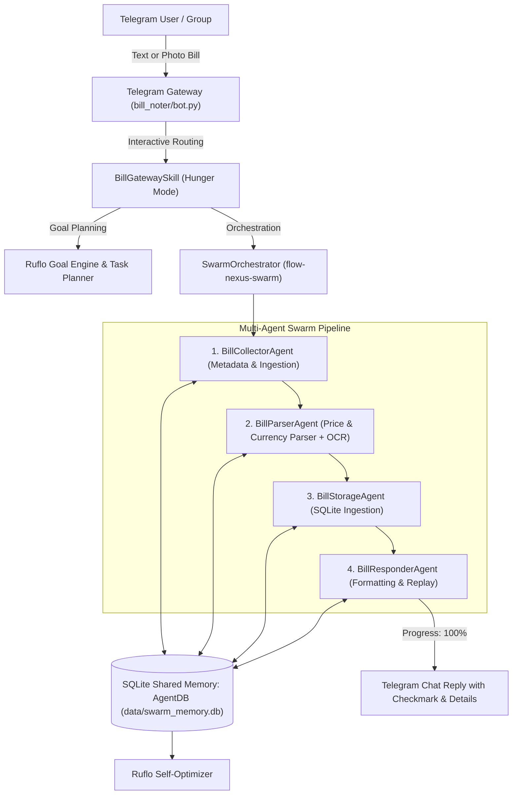

# 🤖 Telegram Bill Payment Gateway & Hunger Noter Bot

> **A persistent, multi-agent AI bill parsing and expense recording bot for Telegram.**
> Powered by **Flow-Nexus-Swarm** (hierarchical multi-agent swarm) and **Ruflo** (goal-oriented
> planning, memory & self-optimization), with automated **OCR receipt capture** and
> **SQLite Shared Memory (`AgentDB`)**.

---

## 🌟 Key Features

- **⚡ Standby & Hunger Detection** — Constantly listens in the Telegram gateway. Aggressively extracts bill items, subtotals, grand totals, and currencies from text and receipt images.
- **📸 Auto-OCR Photo Ingestion** — Downloads receipt photos (GrabFood, FoodPanda, Shopee, Lazada, 7-Eleven, Starbucks, supermarkets, utilities) and performs automatic text recognition using `Tesseract`.
- **⏳ Real-Time Animated Progress Bar** — Live stage-by-stage Telegram message editing (`10% → 20% → 50% → 80% → 100%`) while processing receipts.
- **💬 Conversational Intelligence** — Answers questions and chats with members instead of just standing still.
- **✅ Itemized Confirmation & Replay** — Replies with a checkmark, formatted amount, timestamp, user, source, and OCR snippets.
- **🧠 Ruflo Skill Sets** — 7 progressive-disclosure skill units across orchestration, memory, and analysis (see [Skills](#skills)).
- **🗄️ SQLite Shared Memory (`AgentDB`)** — Thread-safe persistent database for bills, audit logs, and agent states.
- **🔄 Late-Added Catch-Up Scanner (`hunger_catchup.py`)** — Ingests historical chat exports or connects via user session (MTProto) to capture past receipts missed before the bot joined.

---

## 🏗️ Architecture & Multi-Agent Swarm



---

## 🧠 Skills

The bot ships a modular **skill system** (`skills/`) with two top-level skills:

| Skill              | Version | What it does                                             | Skill sets |
|--------------------|---------|----------------------------------------------------------|------------|
| `flow-nexus-swarm` | 1.0.0   | Multi-agent swarm orchestrator for bill capture          | —          |
| `ruflo`            | 1.1.0   | Goal-oriented execution, memory & self-optimization      | **7 units** |

### Ruflo Skill Sets (progressive disclosure)

Ruflo organizes its capabilities into **progressive-disclosure skill sets** — each
capability is a **SKILL.md unit** (a small doc that loads on demand). Read a unit's
`SKILL.md` first; open its `REFERENCE.md` only when you need depth.

#### 🧭 Orchestration & Planning

| Skill unit             | Capability                                                                 |
|------------------------|----------------------------------------------------------------------------|
| `swarm-orchestration`  | Distributed multi-agent task allocation & parallel agent loops             |
| `goal-planner-goap`    | Goal-Oriented Action Planning with **A\* search** over action sequences    |
| `skill-builder`        | Autonomously creates & scaffolds new modular Claude Code Skills            |

#### 🧠 Memory & Self-Learning

| Skill unit                | Capability                                                     |
|---------------------------|----------------------------------------------------------------|
| `agentdb-memory-patterns` | Persistent session states, **HNSW index vector storage**, long-term recall |
| `agentdb-learning`        | Adaptive pattern learning, curriculum learning, neural optimization (SONA) |

#### 🔬 Development & Analysis

| Skill unit           | Capability                                                       |
|----------------------|------------------------------------------------------------------|
| `code-analyzer`      | Architecture audits, security scans, performance & complexity evaluation |
| `sparc-methodology`  | Structured spec-driven design (Specification → Pseudocode → Architecture → Refinement → Completion) |

**Locations:** `skills/ruflo/skills/{orchestration,memory,analysis}/<unit>/SKILL.md`
Index: [`skills/ruflo/SKILL.md`](skills/ruflo/SKILL.md) · Registry: [`skills/SKILL.md`](skills/SKILL.md)

### Using the skills

```bash
# GOAP planner — cheapest action sequence to a goal (A*)
python -c "from skills.ruflo.goap_planner import GoapPlanner, Action; \
print(GoapPlanner().plan([Action('a',{}, {'x':True}, cost=1)], start={}, goal={'x': True}).names)"

# Vector memory — HNSW recall (falls back to brute-force without hnswlib)
python -c "from skills.ruflo.memory import VectorMemory, bag_of_tokens; \
m = VectorMemory('data/mem.db'); m.remember('GrabFood 35.50 USD', bag_of_tokens('GrabFood 35.50 USD')); \
print(m.recall(bag_of_tokens('grab food'), k=1))"

# Scaffold a new skill unit
python -m skills.ruflo.skill_builder --name my-skill --description "Does X. Use when Y."

# Audit the codebase (secrets, syntax, complexity)
python -m skills.ruflo.code_analyzer --path .
```

---

## 📂 Project Structure

```text
telegram-bill-noter/
├── bill_noter_bot.py                 # Primary entry point
├── SOUL.md                          # Immutable soul manifest & bot directive
├── README.md                        # This documentation
├── hunger_catchup.py                # Retroactive history & chat export ingester
├── .env.example                     # Env template (copy to .env, never commit)
├── data/                            # Runtime: SQLite AgentDB + OCR photos (gitignored)
├── docs/
│   └── EMOTES.md                    # Emoji & emote language style guide
├── heal.py                         # Auto-heal supervisor (crash + hang restart)
├── deploy/
│   └── telegram-bill-noter.service # systemd unit for production
│
├── bill_noter/                      # Core Noter package
│   ├── __init__.py
│   ├── bot.py                       # Telegram bot handlers & event loop
│   ├── notes_store.py               # Legacy JSON storage
│   └── price_parser.py              # Multi-currency price extraction engine
│
├── skills/                          # Modular AI skills directory
│   ├── __init__.py                  # SkillRegistry
│   ├── SKILL.md                     # Skill system documentation & index
│   ├── registry.py                  # Dynamic skill discovery (incl. SKILL.md units)
│   ├── bill_gateway_skill.py        # Gateway integration (Chat, OCR, Progress bar)
│   │
│   ├── flow_nexus_swarm/            # Multi-agent swarm implementation
│   │   ├── agents.py                # Collector, Parser, Storage, Responder agents
│   │   ├── orchestrator.py          # Hierarchical pipeline coordinator
│   │   ├── shared_memory.py         # SQLite AgentDB backend
│   │   ├── topology.py              # Swarm topologies (Hierarchical, Mesh, Ring)
│   │   └── SKILL.md
│   │
│   └── ruflo/                       # Goal-oriented framework
│       ├── goal_engine.py           # Goal tracking & lifecycle
│       ├── task_planner.py          # Task decomposition
│       ├── goap_planner.py          # GOAP planner with A* search
│       ├── self_optimizer.py        # Log-based agent learning
│       ├── memory.py                # Sessions + HNSW/brute-force vector recall
│       ├── skill_builder.py         # Scaffolds new skill units
│       ├── code_analyzer.py         # Security / health / complexity audit
│       ├── SKILL.md                 # Progressive-disclosure index
│       └── skills/                  # Skill set units
│           ├── orchestration/{swarm-orchestration, goal-planner-goap, skill-builder}/
│           ├── memory/{agentdb-memory-patterns, agentdb-learning}/
│           └── analysis/{code-analyzer, sparc-methodology}/
│
└── gateway/                         # Gateway scanner & OCR utilities
    ├── bill_detector.py
    ├── checkpoint.py
    ├── gateway.py
    ├── gateway_run.py               # Offline sandbox / live scanner entry point
    ├── ocr.py                       # Tesseract OCR engine wrapper
    └── sandbox.py                   # Offline testing sandbox
```

---

## 🚀 Quick Start

### 1. Requirements

- Python 3.10+
- `tesseract-ocr` installed (`sudo apt install tesseract-ocr`)
- Dependencies: `pip install -r requirements_bill_noter.txt`

### 2. Configuration (`.env`)

Copy `.env.example` to `.env` and fill in your own values — **never commit real tokens**:

```env
# Get your token from @BotFather (REQUIRED)
BILL_NOTER_TOKEN=123456789:AAxxxxxxxxxxxxxxxxxxxxxxxxxxxxxx
# Optional: JSON path for legacy notes (defaults to notes.json)
BILL_NOTER_STORE=notes.json
# Optional: default chat to monitor (used by catch-up scripts)
DEFAULT_CHAT_ID=your_chat_id
```

### 3. Run the Bot

```bash
python bill_noter_bot.py                 # live bot (needs BILL_NOTER_TOKEN)
python bill_noter_bot.py --self-test     # offline parsing test, no network
python bill_noter_bot.py --dry-run       # read messages from stdin, print notes
```

---

## 💬 Bot Commands & Interactions

| Command     | Description                                        |
|-------------|----------------------------------------------------|
| `/start`, `/help` | Show command guide and features.             |
| `/recent`   | List the last 10 notes stored in **Swarm Memory**. |
| `/total`    | Show the total sum and count of noted expenses.    |
| `/swarm`    | View live multi-agent performance metrics & topology. |
| `/optimize` | Trigger the **Ruflo Self-Optimizer** to tune agent parameters. |
| `/status`   | Check running state and active skill plugins.      |

### In-Chat Behavior

1. **Send a text bill:** `GrabFood dinner 35.50 USD` or `FoodPanda lunch 18.00 EUR`
2. **Send a receipt photo:** the bot updates in real time with an animated progress bar and extracts total amounts and store names.
3. **Ask a question:** *"how many bills recorded?"* or *"look into this"* for immediate status.

### 🎨 Emote language

All bot replies use a fixed emoji vocabulary — see [`docs/EMOTES.md`](docs/EMOTES.md).

---

## 🛡️ Auto-Heal (`heal.py`)

The server is protected by a built-in supervisor that keeps the bot and
gateway alive **24/7**: if a process crashes or hangs, it is back up
within seconds (default poll = **5s**, so restart happens in ~5s —
well under 10s).

### How it works
1. **Crash detection** — the supervisor checks every `--poll` seconds;
   a dead process is respawned immediately.
2. **Hang detection** — the bot and gateway write a tiny heartbeat file
   (`data/heartbeat/<name>`) every 10s. A heartbeat older than
   `--stale-after` (default 30s) means the process is hung → it is
   killed and restarted.
3. **Crash-loop protection** — if a service dies within 10s of starting,
   restarts back off exponentially (5s → 10s → … capped at 60s) so a
   misconfigured service can't spin.
4. **Logs** — every service's output goes to `logs/<name>.log`.

### Run it
```bash
python heal.py               # supervise bot + gateway (default)
python heal.py --bot         # bot only
python heal.py --gateway     # gateway only
python heal.py --poll 3      # faster crash detection (~3s)
python heal.py --self-test   # offline verification of restart logic
```

### Production (systemd)
For a real server, run the supervisor under systemd so even the
supervisor itself is restarted if it ever dies:

```bash
sudo cp deploy/telegram-bill-noter.service /etc/systemd/system/
sudo systemctl daemon-reload
sudo systemctl enable --now telegram-bill-noter
```

Adjust `WorkingDirectory` in the unit to your repo path. This gives
two layers of protection: systemd restarts the supervisor, and the
supervisor restarts the bot/gateway in ~5s.

---

## 🔄 Recovering Past Receipts (`hunger_catchup.py`)

If you added the bot late to a group with existing bill history:

1. **Export Chat History in Telegram Desktop** (`JSON` format with Photos).
2. Run the catch-up ingester:
   ```bash
   python hunger_catchup.py path/to/result.json
   ```
3. All historical bills and receipts will be parsed and loaded into `data/swarm_memory.db`!

For programmatic history scraping via a user session (MTProto), use
`HungerHistoryScanner.scan_telegram_history(api_id, api_hash, ...)`.

---

## 🔧 Development

- **Self-test parsing:** `python bill_noter_bot.py --self-test`
- **Gateway offline sandbox:** `python gateway/gateway_run.py --self-test`
- **Audit code:** `python -m skills.ruflo.code_analyzer --path .`
- **Scaffold a skill:** `python -m skills.ruflo.skill_builder --name <skill> --description "<what + when>"`
- **Bot-mode live listener:** `python gateway/gateway_run.py --mode bot --token <TOKEN>`

---

## 📜 License

MIT License.
